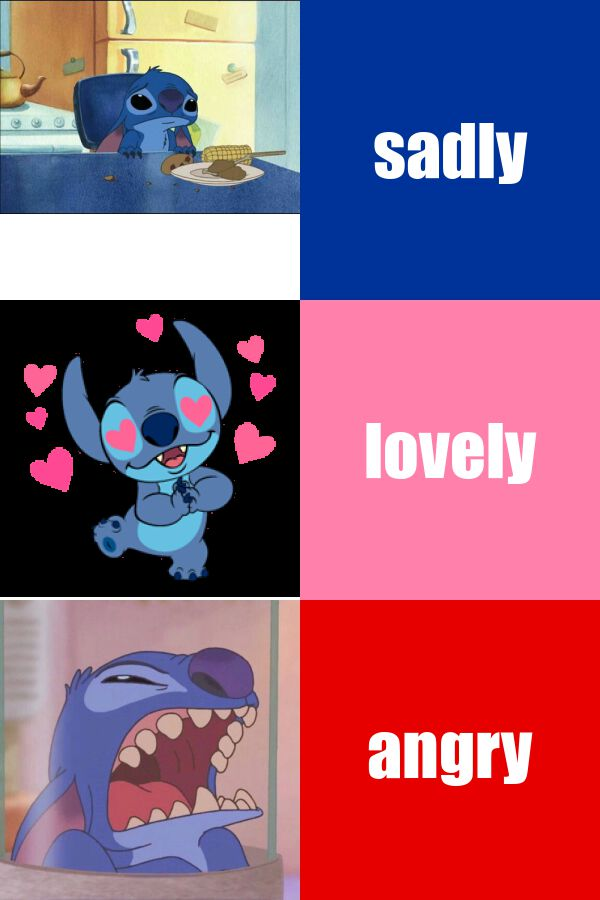

# Hello !! 👋
 
## 🔵🔵About my meme🔵🔵 

*The following is meme I made with R software package[{magick}](https://cran.r-project.org/web/packages/magick/vignettes/intro.html)*

1. I fell in love with Stitch because I watched cartoons when I was a child. I liked his funny😜 and felt very happy to see him💗💗💗💗.
2. I usually chat with my friends and often use meme to better express my emotions.
3. I found three different pictures of stitch to express the sad, love and angry mood.
4. I use the R code to make the my new meme.




## 🎞If you look at my meme and are interested in stitch , you can see this [stitch](https://www.youtube.com/watch?v=4k9i2U77Qfw)💖

## 🔵🔵The code of my meme🔵🔵
```
library(magick)

sad_stitch <- image_read("https://img1.baidu.com/it/u=1611427774,1740682393&fm=253&fmt=auto&app=138&f=JPEG?w=500&h=356") %>% image_scale(300)
love_stitch <- image_read("https://img1.baidu.com/it/u=2031717884,3967519903&fm=253&fmt=auto&app=138&f=PNG?w=229&h=227") %>% image_scale(300)
angry_stitch <- image_read("https://img2.baidu.com/it/u=505077977,2097920837&fm=253&fmt=auto&app=138&f=JPEG?w=500&h=500") %>% image_scale(300)

sad_text <- image_blank(width = 300, height = 300, color = "#003399") %>% image_annotate(text = "sadly", color = "#FFFFFF", size = 70, font = "Impact", gravity = "center" )
love_text <- image_blank(width = 300, height = 300, color="#ff80aa") %>% image_annotate(text = "lovely", color = "#FFFFFF", size = 70, font = "Impact", gravity = "center")
angry_text <- image_blank(width = 300, height = 300, color = "#e60000") %>% image_annotate(text = "angry", color = "#FFFFFF", size = 70, font = "Impact", gravity = "center")

first_row <- c(sad_stitch, sad_text) %>% image_append()

second_row <- c(love_stitch, love_text) %>% image_append()

third_row <- c(angry_stitch, angry_text) %>% image_append()

meme <- c(first_row, second_row, third_row) %>% image_append(stack = TRUE)

image_write(meme,"my_meme.png")

```
